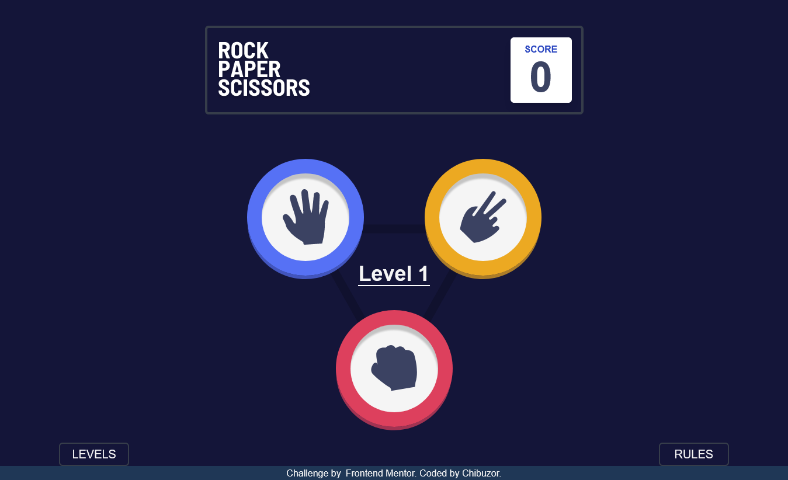

# Frontend Mentor - rock-paper-game

frontend mentor rock, paper, scissors game challenge

This is my solution to the [Rock, Paper, Scissors game Challenge on Frontend Mentor].

# Challenge

Users should be able to:

- View the optimal layout for the game depending on their device's screen size
- Play Rock, Paper, Scissors against the computer
- Maintain the state of the score after refreshing the browser _(optional)_
- **Bonus**: Play Rock, Paper, Scissors, Lizard, Spock against the computer _(optional)_

# Screenshot

# Links

- My Solution URL:https://github.com/PRAISE-C24/rock-paper-game

- Live Site URL: https://praise-c24.github.io/rock-paper-game
  /

# Built with

- Semantic HTML5 markup
- tailwind css
- React JS
- Mobile-first workflow

# What I learned

how to manage state with react.

how to use the localStorage

how to create re-useable components

# Useful resources

- Tailwind css :https://tailwindcss.com/ - the Tailwind css doc helped me understand how it works and how to write css easer and faster.

- React JS :https://reactjs.org/ - the React doc helped me understand how it works and how to manage state easer with react.

## Author

- Name - PRAISE CHIBUZOR
- Twitter - @PRAISE_C24
- Frontend Mentor - @PRAISE-C24 (https://www.frontendmentor.io/profile/PRAISE-C24)
